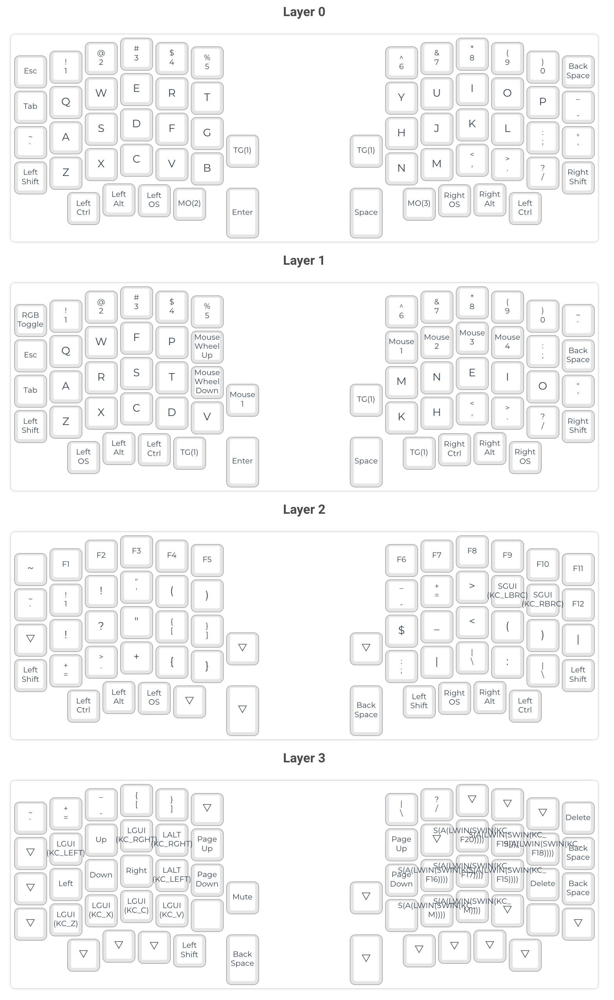

# Sofle Keyboard - RGB version with Pimoroni Trackball - Lucacri keymap

## Installation instructions

Clone this repository in `/keyboards/sofle/keymaps/lucacri_rgb`.

## Compilation instructions

Flash using the correct command below (or use QMK Toolbox). These commands can be mixed if, for example, you have an Elite C on the left and a pro micro on the right.

Press reset button on the keyboard when asked.

Disconnect the first half, connect the second one and repeat the process.

```
qmk flash -kb sofle/rev1 -km lucacri_rgb -e CONVERT_TO=kb2040 -j 0 && qmk flash -kb sofle/rev1 -km lucacri_rgb -e CONVERT_TO=kb2040 -j 0
```

## Keymaps

To convert the `keymap.c` to a JSON that can be read by QMK Configurator:

```bash
qmk -v c2json -km lucacri_rgb -kb sofle/rev1 --no-cpp keymap.c -o keymap.json
```

and to go from QMK configurator JSON to keymap.c:

```bash
qmk json2c -o exported-keymap.c keymap.json
```

an example of the keymap and layers is the following:

